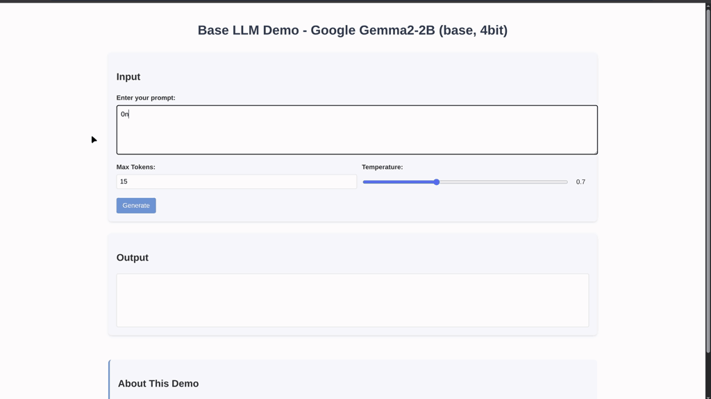

# Base LLM Demo

Educational Flask app to visualize how LLMs generate text token-by-token. Uses Google Gemma2-2B (4-bit quantized) to explore next-token prediction, temperature effects, and log probabilities interactively.



## Setup

```bash
# Create environment
python -m venv venv
source venv/bin/activate  # or venv\Scripts\activate on Windows

# Install requirements
pip install -r requirements

# Run
python app.py
```

Visit `http://localhost:5000`

## Usage

1. Enter a prompt
2. Adjust temperature (0.0 = deterministic, 2.0 = random)
3. Generate text
4. Hover over tokens to see alternatives
5. Click alternatives to regenerate from that point

Downloads ~1.5GB model on first run. Works on CPU but GPU recommended.